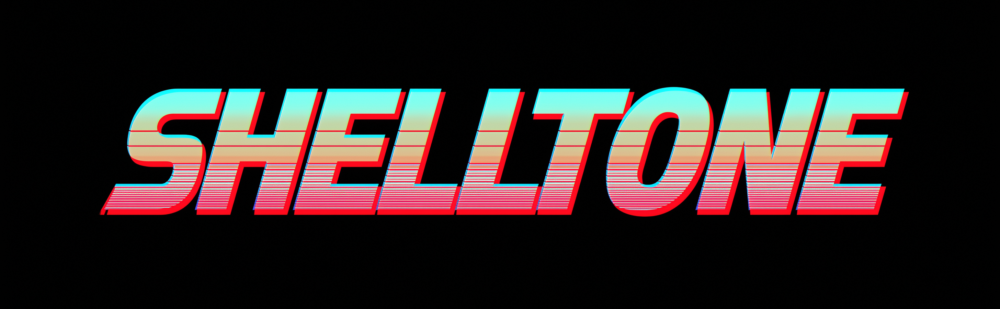

<p align="center">
  
</p>

<p align="center">
  A small, colorful Bash and Zsh prompt that looks good in the font you already use.
</p>

# Shelltone

[](https://github.com/LPF9000/shelltone/actions/workflows/ci.yml)

Shelltone is a dependency-free Bash and Zsh prompt with a little bit of retro glow and none of the usual font ceremony. It is for people who want a useful prompt—not a dashboard bolted to their shell. No Nerd Font, no Powerline glyphs, no plugin manager, and no framework required.

It keeps the good parts close: the directory and Git branch, with optional command result, duration, jobs, environment, remote context, and clock. Both shells drop optional details when space runs short. Zsh also measures display-cell widths and truncates an oversized left prompt.

## What it feels like

```text
╭─ ~/projects/shelltone ⎇ main ⇡1 +2 !1 ?1 ▓▒░       ░▒▓ ✔ · 4s · 11:17:04 AM
╰─ > git status
```

Setup starts with three finished design paths plus **Custom**. **Signal** is the layered, Powerlevel-inspired path; it lets you tune a solid or stepped bar, its joins, and its shade depth without changing its palette. **Still** is a transparent, Pure-inspired path using Pure's published default color assignments. **Contour** is a compact, Purity-inspired path with its Git detail held close to the working directory. Choose **Custom** to pair any of **Tenfold**, **Afterglow**, **Night Shift**, **Northstar**, **Harbor**, or **Sunset Strip** with **frame**, **pure**, **zen**, or **blocks**.

Transparent silhouettes deliberately do not expose shaded-bar controls or dashboard details. Bar-capable silhouettes show only the controls that affect them: solid versus stepped fields, visible versus seamless joins, shade depth, height, clock, status, and duration. The stepped Blocks silhouette uses ordinary Unicode diagonal joins rather than font-specific Powerline glyphs.

## Try it without touching your shell

Clone the repository, then run:

```sh
./bin/try-shelltone --shell zsh
./bin/try-shelltone --shell bash
```

That opens a child shell with isolated startup files. It does not read or alter your regular shell configuration. Type `exit` when you are done; the temporary startup directory and its history go away with it.

The sandbox changes no startup file, alias, history file, or setting outside its disposable child shell. It is only for trying Shelltone’s prompt palettes and styles.

## Make it yours

Inside the sandbox, run the live configuration wizard. It presents color-coded palette cards, structural-style choices, and a live ANSI preview before writing anything:

```sh
shelltone configure
shelltone reload
```

It previews the whole chosen design path before writing a config file. For a quick non-interactive starting point:

```sh
./bin/shelltone configure --theme tenfold --style frame --preset classic
./bin/shelltone configure --theme night-shift --style pure --preset compact
```

By default this writes `config/shelltone.zsh`; pass `--output FILE` to keep a separate config. The settings are plain shell assignments and 256-color values, which makes new themes easy to add, copy, and tune without learning a mini language.

To enable it permanently, use the backup-first installer. It only appends a marked source line after confirmation and copies the startup file before changing it:

```sh
./bin/shelltone install zsh
./bin/shelltone install bash
```

Use `--dry-run` to inspect the target without changing files. Shelltone never replaces a startup file or changes any other shell configuration.

## Git at a glance

The Git segment reports only state that needs attention. Colors are theme-specific and intentionally distinct:

- `⇣` / `⇡` — commits behind or ahead of the upstream branch.
- `⇠` / `⇢` — commits behind or ahead of a separately configured push branch.
- `+` — staged files; `!` — modified files; `?` — untracked files.

This makes `⇣21 ⇡27 ⇠21 ⇢27 +6 !12 ?1` readable without turning the prompt into a full status screen.

Signal also distinguishes conflicts (`~`) and stashes (`*`), and shows an operation label such as `merge` or `rebase`. Still uses a dirty `*`, movement arrows without counts, and operation labels. Contour uses presence markers for added (`✓`), modified (`✶`), deleted (`✗`), renamed (`➜`), conflicted (`═`), and untracked (`✩`) files.

Git refresh runs in the background in interactive shells. Zsh redraws when the result arrives; Bash applies it on the next prompt. Changing directories clears the previous directory's data. No automatic fetch is performed, so movement reflects locally known remote refs. Set `SHELLTONE_GIT_ASYNC=false` for synchronous refresh, `SHELLTONE_GIT_UNTRACKED=false` to skip untracked files, or `SHELLTONE_SHOW_GIT=false` to disable Git collection.

## Preset behavior and integration

Still shows the home-relative path; Contour shows the current directory name. Signal abbreviates parent components when the path is long, keeping the final directory name. This is a lightweight abbreviation, not unique-prefix completion. Override `SHELLTONE_PATH_MODE` with `full`, `basename`, or `auto` after the theme/layout assignments. Slow-command durations use readable hours, minutes, and seconds; Still and Contour use a five-second threshold.

In Zsh, Signal and Still change the prompt symbol to `❮` when vi command mode is already enabled. Shelltone does not change editing key bindings. Set `SHELLTONE_TRANSIENT=true` to collapse submitted Zsh prompts to the prompt symbol; this is independent of blank-line spacing. The configuration command also accepts `--transient true`. Bash currently retains full previous prompts and its existing editing-mode behavior.

For Oh My Zsh, set `ZSH_THEME=""` and source `shelltone.plugin.zsh` after loading Oh My Zsh, or link this checkout into `$ZSH_CUSTOM/plugins/shelltone` and add `shelltone` to the plugin list. Other managers can explicitly load the same plugin file. Enable only one prompt engine. Shelltone leaves syntax highlighting to your existing plugins; its optional custom highlighter is disabled by default and preserves other plugins' highlights.

The Bash renderer requires Bash 4.4 or newer. Rendering uses ordinary Unicode and 256-color terminal support; a patched font is not required. Font fallback and emoji width still depend on the terminal. The automated tests cover wide-character accounting in Zsh, not the appearance of every installed font.

## Optional alias packs

Shelltone never changes aliases unless asked. The sandbox enables the `starter` pack, which includes `ll`, `la`, `foldersize`, `projects`, and `reload`. Enable a pack explicitly in an existing shell:

```sh
shelltone aliases starter
shelltone aliases navigation
shelltone aliases git
```

## Themes, without bloat

Shelltone starts setup with a theme picker, then walks through that theme's layout, spacing, clock, and status choices before it writes anything. The [theme plan](./ROADMAP.md) keeps the future palette intentional: a few distinct, well-considered looks—not an endless cargo hold of modules.

## What is in here

- `shelltone.zsh` and `shelltone.bash` — small prompt engines behind the `shelltone` command.
- `config/shelltone.zsh` — the editable default theme configuration, shared by both shells.
- `themes/` — portable palette definitions.
- `shelltone-sandbox.zsh` and `shelltone-bash-sandbox.sh` — isolated child-shell startup logic.
- `shelltone-aliases.sh` — opt-in convenience packs.
- `bin/try-shelltone` — safe preview launcher.
- `bin/shelltone` — the public Shelltone command.
- `bin/shelltone-configure` — configuration wizard and presets.
- `tests/check.zsh` and `tests/check.bash` — syntax and behavior smoke checks.

Run the checks with:

```sh
./tests/check.bash
./tests/check.zsh
python3 tests/test-runtime.py -v
```
